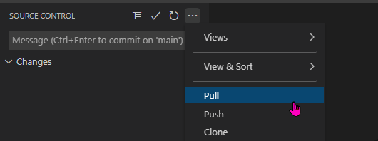

# Intro to Python

## Healthy Gamer Discord 2022

## Project Structure

There are quite a few `.ipynb` files in the root of the project. These are Jupyter notebook files used to explain concepts and contain demo code, but aren't part of any program. Instead, inside the bot folder are `.py` files that are regular python files used to create the project program.

## Setup

There are several development environments to choose from, but Visual Studio Code is one of the most popular. The latest instructions can be found here: [https://code.visualstudio.com/docs/languages/python](https://code.visualstudio.com/docs/languages/python)

You will need:

- git installed on your machine
- Python 3 installed on your machine
- Python extension in Visual Studio Code
- (For the tutorial pages) Jupyter extension for Visual Studio Code. [https://mybinder.org/v2/gh/HealthyGamer/IntroToPython/main](https://mybinder.org/v2/gh/HealthyGamer/IntroToPython/main) will allow you to run the notebooks online.

## Cloning the Repo

You can download the code for this series as a zip file, but it's easier to maintain your code by using git (and also best practice). You'll need to have git installed on your machine for this: [https://git-scm.com/book/en/v2/Getting-Started-Installing-Git](https://git-scm.com/book/en/v2/Getting-Started-Installing-Git). Having your own Github account is also helpful, but not required.

There are several ways to interact with git on your computer. Visual Studio Code has a tab for it on the left navigation menu (the icon that looks a bit like a Y), you can download seperate clients like Github Desktop or Source Tree, or you can work with it using a command line interface. People often find it easier to start with a UI and then try different methods to see what works best for them.

In order to get the code from GitHub, create a folder on your computer where you want to keep the project and open it in VSC. In the git tab, click the button to initialize the repository.

From the same sidebar, open the menu and choose Clone

In the text box paste the URL "https://github.com/HealthyGamer/IntroToPython.git". You can also get this link by going to a repo on GitHub and clicking the green Code button.

Choose the folder you are currently in and add it to the workspace.

Sending changes back to your own GitHub account requires forking the repo, which you can read about here: [https://docs.github.com/en/get-started/quickstart/fork-a-repo](https://docs.github.com/en/get-started/quickstart/fork-a-repo)

## Pulling the Latest Code

Pulling down new code is very similar to getting the code the first time. In the Source Control tab open the menu and choose Remote > Add. Paste in the same link "https://github.com/HealthyGamer/IntroToPython.git". Give it a name, I generally use "source" but it doesn't matter.

From there you can choose Pull from that menu in order to get the latest changes from Github.

